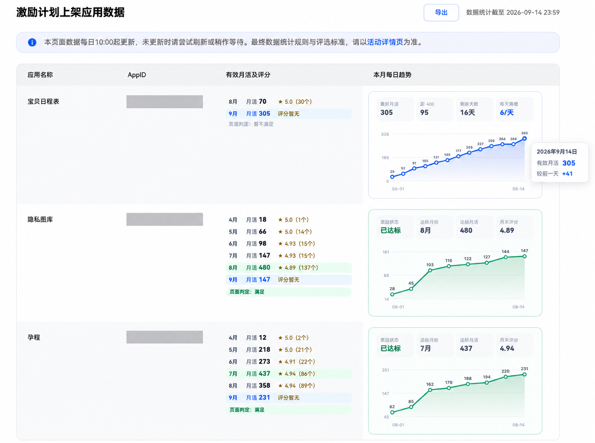

# 华为激励数据助手

一个面向华为开发者联盟“鸿蒙应用开发者激励计划 2026”应用查询页的 Chrome 扩展。

它会自动展开每个应用的“有效月活及评分”详情，并在表格右侧常驻展示本月每日有效月活趋势，减少逐个点击查看的重复操作。

## 效果预览

安装后，原查询页会直接展示各月有效月活和评分，并在右侧生成每日趋势、距 400 差值、剩余天数及每天所需增量。

## 功能

- 自动读取并展开每个应用各月份的有效月活、月末评分和评分个数。
- 根据页面“数据统计截至”日期，在本机缓存每日有效月活。
- 常驻展示本月折线图、最新月活、距 400 差值、剩余天数和每天所需增量。
- 鼠标悬停数据点可查看具体日期和有效月活，提示跟随鼠标并自动避让窗口边缘。
- 悬停提示显示较前一自然日的月活增量；前一天无记录时显示“暂无”。
- 优先展示“暂不满足”的应用；同一状态内按个性化优先级和页面原顺序排列。
- 达标应用使用绿色状态和趋势样式。
- 自动隐藏应用类型、首次上架时间、在架状态、功能完备情况、账号服务及热门应用模块。
- 不请求额外扩展权限，不读取 Cookie，不向外部服务器发送数据。

## 安装

1. 从 [最新发布版本](https://github.com/VeerHan/huawei-incentive-helper/releases/latest) 下载 `huawei-incentive-helper-版本号.zip` 并完整解压，也可克隆本仓库。
2. 在 Chrome 地址栏打开 `chrome://extensions`。
3. 开启右上角“开发者模式”。
4. 点击“加载已解压的扩展程序”。
5. 选择包含 `manifest.json` 的项目目录。
6. 登录华为开发者联盟并打开：
   `https://developer.huawei.com/consumer/cn/activity/harmonyos-incentive/data-query2026`

更详细的说明见 [INSTALL.md](./INSTALL.md)。

## 更新

这是通过开发者模式加载的扩展，不会随 GitHub 发布自动升级。

1. 下载并解压新版安装包。
2. 若修改过 `personal-config.js`，先备份并在更新后保留自己的配置；分享包中的配置默认为空。
3. 将新版文件覆盖到原来加载的扩展目录，保持目录路径不变。
4. 打开 `chrome://extensions`，点击“华为激励数据助手”的重新加载按钮，确认版本号已更新。
5. 刷新华为查询页，新功能才会生效。

## 本地数据

每日趋势存储在华为开发者联盟站点的 `localStorage` 中：

- 刷新页面或重启 Chrome 后仍会保留。
- 清除该网站的数据会清空历史趋势。
- 日期采用页面“数据统计截至”日期，不是打开页面的日期。
- 只有访问页面并成功读取数据时才会记录；扩展不会在后台自动补齐漏掉的日期。
- 同一统计日期重复访问时更新同一条记录，不会重复新增；标记为 `manual` 的手动记录不会被页面采集覆盖。
- “较前一天”只比较前一自然日：增长显示正数，持平显示 0，减少显示负数；缺少前一天记录时显示“暂无”，不会使用上一条更早的记录代替。
- 手动补齐值也会参与增量计算，因此该差值不一定代表实际单日增长。
- 400 月活进度和每天所需增量仅供参考，最终达标状态以华为页面判定为准。

## 可选个性化

`personal-config.js` 支持配置优先展示的 AppID 和预置历史数据。公开仓库中的配置为空；请勿提交包含个人 AppID 或业务数据的配置。

## 请作者喝杯咖啡

如果这个项目对你有帮助，欢迎请作者喝杯咖啡。支持完全自愿，感谢每一份鼓励！

  <table>
    <tr>
      <td align="center"><strong>支付宝</strong> </td>
      <td align="center"><strong>微信支付</strong> </td>
    </tr>
  </table>

## 兼容性

- Chrome Manifest V3
- 仅匹配华为 2026 激励计划应用查询页
- 页面结构变化后可能需要同步调整选择器

## 许可证

[MIT License](./LICENSE)

本项目与华为无隶属或官方合作关系，是针对公开开发者页面的第三方辅助工具。
